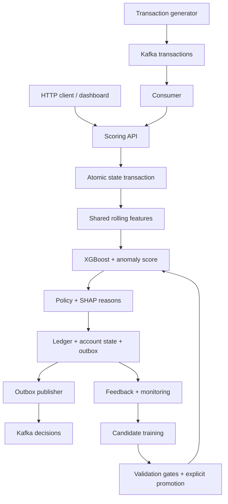

# Architecture and decision policy

The outbox publisher and Kafka consumer run in the same worker. HTTP events also reach the outbox; Python-only mode leaves it pending until a broker worker is started.

## Correctness boundary

SQLite `BEGIN IMMEDIATE` serializes writes across threads/processes. An input is validated, fingerprinted, checked for duplicates, transformed from prior account history, scored and committed together with updated history and its decision outbox. If scoring raises, none of these changes commit. Retries return the original decision and model version. Reusing an ID with different content returns 409. Idempotency persists for as long as ledger records remain; deleting ledger rows changes that guarantee.

An account watermark rejects events older than its most recent accepted timestamp. Equal timestamps follow ingestion order. This is a deliberately strict policy; arbitrary out-of-order processing and late-event correction need a separate replay/state reconstruction system. Kafka partition keys preserve per-account ordering, but API clients must respect it too. Do not concurrently mix historical Kafka replay and current HTTP traffic for the same account.

Kafka offsets commit only after a durable API decision (or confirmed DLQ publication). The publisher sends pending outbox rows and marks delivery only after Kafka delivery confirmation. A crash between send and mark can duplicate output: consumers of `decisions` must deduplicate by transaction ID. This is at-least-once output with idempotent scoring, not distributed exactly-once delivery. The DLQ includes metadata/reason without raw input content; original events remain available in the source topic until retention expires.

## Features and leakage

Both training and inference call `extract` and `advance`. Features use only preceding events, never the fraud label or future events. History is bounded to 24 hours and the 1000 most recent events. `new_device` therefore means unseen in retained history, not unseen over the entire customer lifetime. `sum_5m` is log-transformed; `amount_ratio` uses the retained historical mean, defaults to a 100-unit baseline for new accounts, and caps at 100. This cold-start assumption must be tuned for actual data.

Training splits chronologically into 60% train, 20% validation and 20% holdout. The offline history carries forward across splits, as it does in online service; model fitting uses train rows only. Isolation Forest trains on legitimate train rows, with its anomaly score mapped to an empirical training percentile. The ensemble weight is fixed at 95/5 for a clear demonstration. Compare classifier-only, anomaly-only and blended baselines on a fresh dataset before defending the mixture as optimal.

## Policy, explanations and metrics

Select the model BLOCK threshold on validation to maximize recall subject to FPR ≤ 1%. REVIEW begins at 65% of that threshold, and two rules can elevate APPROVE to REVIEW. The validation FPR budget covers BLOCK only, not review workload or the complete policy; measure review rate and precision@review-capacity separately for business deployment.

Native Tree SHAP contributions sum with the bias term to the classifier margin. The response exposes top positive contributions in log-odds. They explain only XGBoost, not the anomaly percentile or rules. They are not causal explanations or calibrated probabilities. Rule reasons are separately listed.

Monitor PSI against training histograms over the latest 1000 decisions. PSI > 0.2 flags an investigation after at least 100 samples. Binary/discrete features and seasonal populations can trigger large PSI; the heuristic is not proof that the model degraded. Observed feedback metrics require both classes and at least 100 labels. They mix original per-decision model versions; use version-stratified windows for release decisions. Performance is selected-label performance unless labels cover a representative mature cohort.

## Scaling and reliability

One API process and a shared local SQL file provide a durable reference implementation, not high availability. Model inference and database writes occur under the write lock, limiting throughput. Redis is only a decision-read cache. Horizontal scaling needs a durable shared transaction store (e.g. Postgres), explicit account-state concurrency, separate outbox publisher ownership and remote immutable model artifacts. Do not add replicas to the provided reference manifest.

Rollback changes the model pointer and affects future decisions after reload. It preserves prior decisions and does not rewind feature history. Candidate training is isolated in a new version directory. The pointer is atomically replaced, with the prior version saved; concurrent trainers/promoters are unsupported.

Prometheus latency includes durable commit and excludes response network transport. Stored `latency_ms` is core work through inference and excludes commit. The demo measures serial client HTTP latency and records its concurrency. A genuine sub-100ms SLO needs sustained concurrent tests, documented hardware, load mix, p95/p99 and fault injection.
